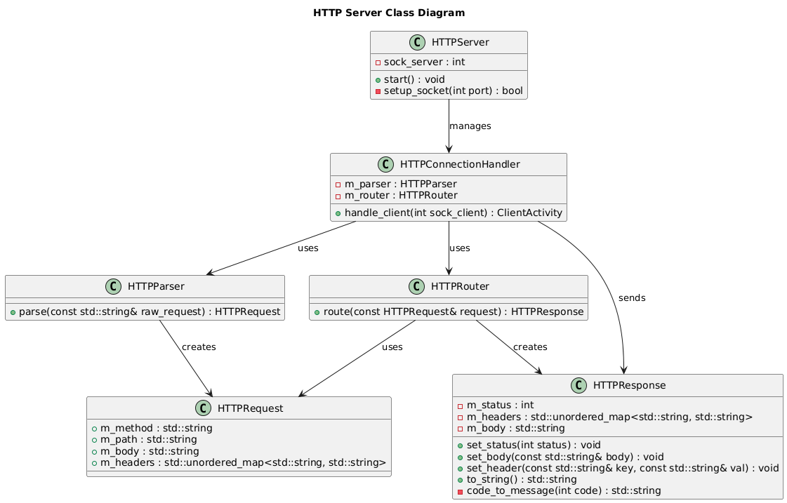

```plantuml
@startuml

title HTTP Server Class Diagram

class HTTPServer {
    - sock_server : int
    + start() : void
    - setup_socket(int port) : bool
}

class HTTPConnectionHandler {
    - m_parser : HTTPParser
    - m_router : HTTPRouter
    + handle_client(int sock_client) : ClientActivity
}

class HTTPParser {
    + parse(const std::string& raw_request) : HTTPRequest
}

class HTTPRouter {
    + route(const HTTPRequest& request) : HTTPResponse
}

class HTTPRequest {
    + m_method : std::string
    + m_path : std::string
    + m_body : std::string
    + m_headers : std::unordered_map<std::string, std::string>
}

class HTTPResponse {
    - m_status : int
    - m_headers : std::unordered_map<std::string, std::string>
    - m_body : std::string
    + set_status(int status) : void
    + set_body(const std::string& body) : void
    + set_header(const std::string& key, const std::string& val) : void
    + to_string() : std::string
    - code_to_message(int code) : std::string
}

HTTPServer --> HTTPConnectionHandler : manages
HTTPConnectionHandler --> HTTPParser : uses
HTTPConnectionHandler --> HTTPRouter : uses
HTTPParser --> HTTPRequest : creates
HTTPRouter --> HTTPRequest : uses
HTTPRouter --> HTTPResponse : creates
HTTPConnectionHandler --> HTTPResponse : sends

@enduml
```
